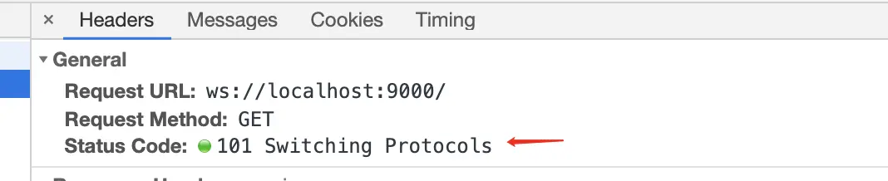

### 为什么使用websocket
- 我们知道在websocket出现之前，客户端与服务端的通讯都是由http协议来通信的然而`http`协议都是由客户端向服务端发起请求，服务端响应，返回结果给客户端。
服务器做不到主动向客户端推送。
- 这种单向请求的特点，就会限制如果服务器有连续的持续变化，客户端获取就非常麻烦，就要由客户端不断的发起请求，就是说的`轮询`,就是每隔一段时间发起一个请求，这样做
就会大大降低效率，造成资源浪费（因为不停的发请求，http不停的连接，或者是http一直保持连接）
- 这样我们的`websocket`就产生了。
### websocket特点
- 实现了客户端和服务端双向通讯的能力。
- 性能比http好，省去了频繁建立连接和关闭连接的过程。
### 短轮询
- 就是浏览器每隔一段时间就向服务器发送http请求，服务端接收到请求后，不论是否有数据更新，都直接进行响应，再服务端响应完成就会关闭这个tcp连接。
- 实现
```
setInterval(function(){
	axios(url,data).then(res=>{
		//....doSomthing
	})
},3000)
```
缺点：会造成数据再一小段时间内不同步和大量无效的请求，资源浪费，安全性差。
###  长轮询
- 客户端发送请求后服务器不会立即返回数据，服务器会阻塞请求连接不会立即断开，直到服务器端有数据更新，或是连接超时才会返回，客户端才再次发出请求，
新建连接，如此反复从而获取最新数据。
- 实现
```
function async(){
	axios(url,data).then((res)=>{
		async();	//成功
	}).catch(()=>{
		async();  //超时
	})
}
```
特点：比短轮询做了优化，有较好的时效性。
缺点：一直保持连接，消耗资源，服务器没有返回有效数据，程序超时。
### websocket通讯原理
- 当客户端和服务端建立`websocket`连接时，在客户端和服务端握手的过程中，客户端首先向服务端发送一个http请求，包含一个 Upgrade 请求头来告知服务端，客户端想要建立一个 WebSocket 连接。
- 在客户端建立一个websocket连接：
```
let ws = new WebSocket('ws://localhost:3000')  //地址为服务端的地址
```
以`ws`为例子,请求头如下：
```
	Accept-Encoding: gzip, deflate, br
	Accept-Language: zh-CN,zh;q=0.9
	Cache-Control: no-cache
	Connection: Upgrade	// 表示该连接要升级协议
	Cookie: _hjMinimizedPolls=358479; ts_uid=7852621249; CNZZDATA1259303436=1218855313-1548914234-%7C1564625892; csrfToken=DPb4RhmGQfPCZnYzUCCOOade; JSESSIONID=67376239124B4355F75F1FC87C059F8D; _hjid=3f7157b6-1aa0-4d5c-ab9a-45eab1e6941e; acw_tc=76b20ff415689655672128006e178b964c640d5a7952f7cb3c18ddf0064264
	Host: localhost:9000
	Origin: http://localhost:9000
	Pragma: no-cache
	Sec-WebSocket-Extensions: permessage-deflate; client_max_window_bits
	Sec-WebSocket-Key: 5fTJ1LTuh3RKjSJxydyifQ==		// 与响应头 Sec-WebSocket-Accept 相对应
	Sec-WebSocket-Version: 13	// 表示 websocket 协议的版本
	Upgrade: websocket	// 表示要升级到 websocket 协议
	User-Agent: Mozilla/5.0 (Macintosh; Intel Mac OS X 10_14_0) AppleWebKit/537.36 (KHTML, like Gecko) Chrome/76.0.3809.132 Safari/537.36

```
- 响应头如下
```
	Connection: Upgrade
	Sec-WebSocket-Accept: ZUip34t+bCjhkvxxwhmdEOyx9hE=
	Upgrade: websocket
```
 

 > 此时相应行General中可以看到状态码：`Status code:101 Switching Protocols`,表示该连接已经从http协议转换为WebSocket通信协议。转换成功后，该连接没有中断，而是建立了一个全双工通信，后续发送和接收消息都会走这个连接通道。
 > `Sec-WebSocket-Key` 字段，和响应头中的 `Sec-WebSocket-Accept`是想对应的，它的作用是提供了基本的防护，比如恶意的连接或是无效的连接。
 `Sec-WebSocket-Key`是客户端随机生成的一个base64编码，服务器会使用这个编码，并根据一个固定的算法：
 ```
 GUID = '258EAFA5-E914-47DA-95CA-C5AB0DC85B11';  //GUID 字符串是 RFC6455 官方定义的一个固定字符串，不得修改
 accept = base64(sha1(key + GUID)); //key就是Sec-WebSocket-Key值，accept就是Sec-WebSocket-Accept值
 ```
 > 客户端拿到服务端响应的`Sec-WebSocket-Accept` 后，会拿自己之前生成的`Sec-WebSocket-Key`用相同的算法算一次，如果匹配，则握手成功，然后判断response状态码是否为101（切换协议），如果是就建立连接。
 